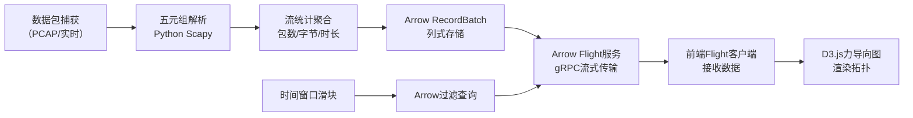

## 1. 产品概述
网络流量分析工具，用于实时或离线分析网络数据包，通过可视化拓扑图展示IP节点间的通信关系与流量特征。面向网络管理员、安全分析人员，提供直观的流量洞察能力。

## 2. 核心功能

### 2.1 用户角色
| 角色 | 注册方式 | 核心权限 |
|------|----------|----------|
| 网络管理员 | 无注册，本地工具 | 查看流量拓扑、调整时间窗口、分析流数据 |

### 2.2 功能模块
1. **数据采集层**：PCAP文件读取或实时网卡抓包，解析五元组信息
2. **流量统计层**：按流聚合包数、字节数、持续时间等指标
3. **数据传输层**：基于Arrow Flight的高性能流式数据推送
4. **可视化层**：D3.js力导向拓扑图，节点为IP，边表示流量
5. **交互控制层**：时间窗口进度条，动态过滤数据

### 2.3 页面详情
| 页面名称 | 模块名称 | 功能描述 |
|----------|----------|----------|
| 主界面 | 顶部控制栏 | 时间窗口进度条、开始/停止按钮、当前统计摘要 |
| 主界面 | 拓扑图区域 | D3.js力导向图，IP节点可拖拽，边粗细/颜色映射流量与协议 |
| 主界面 | 图例说明 | 协议颜色映射、流量粗细说明 |
| 主界面 | 流详情面板 | 点击节点/边显示详细流信息 |

## 3. 核心流程
后端持续抓包或读取PCAP，解析为五元组流并统计，存入Arrow RecordBatch。前端通过Arrow Flight订阅数据，拖动时间窗口时后端过滤并推送对应数据，前端更新D3拓扑图。

## 4. 用户界面设计

### 4.1 设计风格
- **主色调**：深色科技风，背景`#0a0e17`，主色`#00d4ff`（青色）
- **辅助色**：TCP为`#ff6b6b`（红），UDP为`#4ecdc4`（青），ICMP为`#ffe66d`（黄）
- **字体**：JetBrains Mono 等宽字体，营造终端/工具感
- **布局**：顶部控制栏固定，主体为拓扑图区域，右侧悬浮详情面板
- **视觉细节**：节点发光效果、边渐变描边、背景网格点阵、科技感投影

### 4.2 页面设计概述
| 页面名称 | 模块名称 | UI元素 |
|----------|----------|----------|
| 主界面 | 控制栏 | 渐变进度条带可拖拽手柄、脉冲动画的状态指示器、发光按钮 |
| 主界面 | 拓扑图 | 节点光晕效果、根据字节数动态计算边粗细、协议颜色映射、鼠标悬停tooltip |
| 主界面 | 详情面板 | 毛玻璃背景、等宽字体表格、流量大小条形图 |

### 4.3 响应性
桌面端优先设计，拓扑图区域自适应窗口大小，控制栏在窗口缩小时自动换行。

### 4.4 动效设计
- 页面加载：节点从中心向外扩散出现，边渐显
- 数据更新：新节点淡入，边粗细平滑过渡
- 节点拖拽：带弹性回弹效果
- 时间窗口调整：数据更新时有平滑过渡动画
