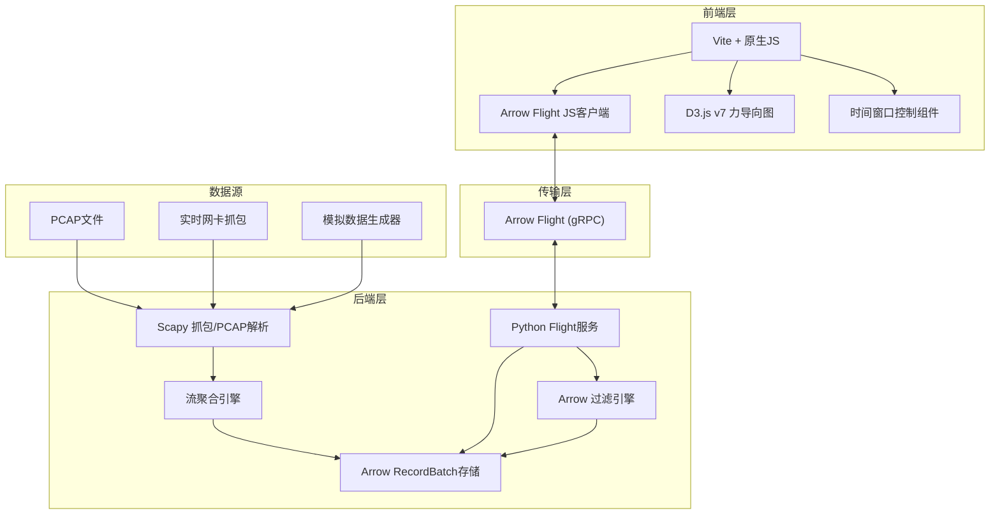
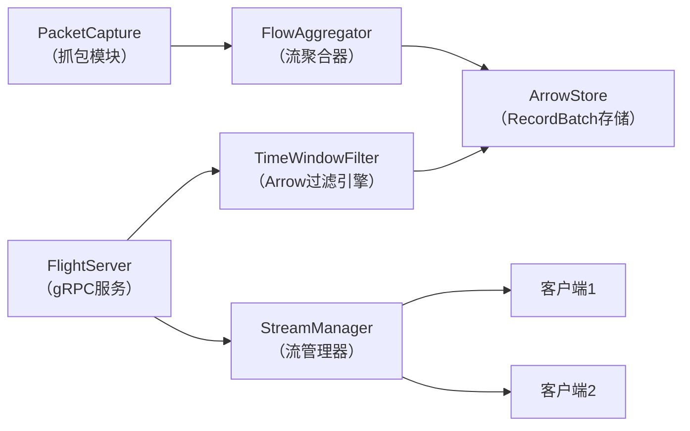
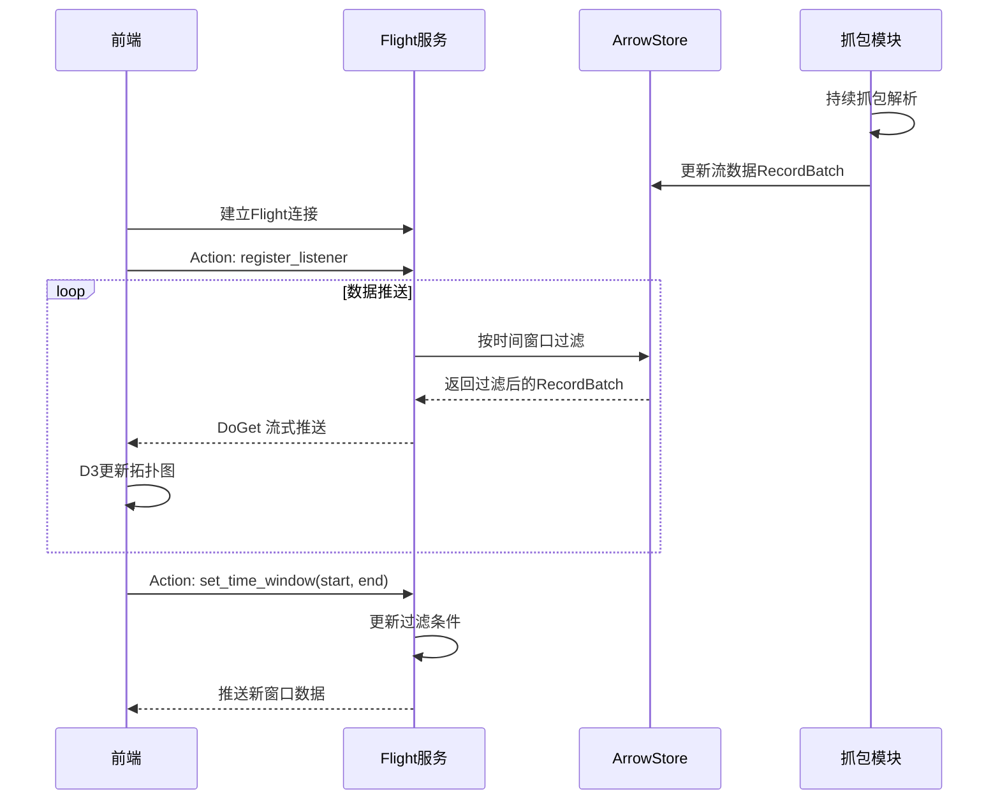

## 1. 架构设计



## 2. 技术描述

### 2.1 后端技术栈
- **Python 3.10+**
- **Scapy 2.5+**：数据包捕获与解析
- **PyArrow 15.0+**：Arrow列式存储与Flight RPC
- **Pandas 2.0+**：数据处理辅助

### 2.2 前端技术栈
- **Vite 5.0+**：构建工具
- **原生JavaScript (ES6+)**：不使用框架，保持轻量
- **D3.js v7**：力导向图可视化
- **Apache Arrow JS 15.0+**：Flight客户端与数据处理
- **@grpc/grpc-js**：gRPC底层支持

## 3. 数据模型

### 3.1 流数据Schema (Arrow RecordBatch)

| 字段名 | 类型 | 说明 |
|--------|------|------|
| `flow_id` | Utf8 | 流唯一标识（五元组哈希） |
| `src_ip` | Utf8 | 源IP地址 |
| `dst_ip` | Utf8 | 目标IP地址 |
| `src_port` | UInt16 | 源端口 |
| `dst_port` | UInt16 | 目标端口 |
| `protocol` | Utf8 | 协议（TCP/UDP/ICMP） |
| `packet_count` | UInt64 | 包数量 |
| `byte_count` | UInt64 | 总字节数 |
| `start_time` | Timestamp(ns) | 流起始时间 |
| `end_time` | Timestamp(ns) | 流结束时间 |
| `duration` | Float64 | 持续时间（秒） |

## 4. Arrow Flight API 定义

### 4.1 Flight 端点
- **Action: `register_listener`**：注册客户端监听器
- **Action: `set_time_window`**：设置时间窗口过滤条件
- **FlightDescriptor: `flow_data`**：流数据订阅通道

### 4.2 数据过滤机制
使用Arrow的`compute.filter`和`compute.project`函数，基于`start_time`和`end_time`字段进行时间窗口过滤。

## 5. 后端服务架构



### 5.1 核心模块说明

| 模块 | 职责 | 文件 |
|------|------|------|
| PacketCapture | PCAP读取/实时抓包、五元组解析 | `backend/packet_capture.py` |
| FlowAggregator | 按流聚合统计、更新RecordBatch | `backend/flow_aggregator.py` |
| ArrowStore | RecordBatch管理、时间索引 | `backend/arrow_store.py` |
| FlightServer | Flight RPC服务实现 | `backend/flight_server.py` |
| TimeWindowFilter | Arrow过滤表达式构建与执行 | `backend/filter.py` |

## 6. 前端模块结构

```
frontend/
├── src/
│   ├── main.js              # 入口
│   ├── flight-client.js     # Arrow Flight客户端
│   ├── topology-graph.js    # D3力导向图
│   ├── time-slider.js       # 时间窗口控件
│   └── styles.css           # 样式
├── index.html
└── vite.config.js
```

## 7. 数据流转时序



## 8. 目录结构

```
e:\trae3\a67\
├── backend/
│   ├── __init__.py
│   ├── packet_capture.py
│   ├── flow_aggregator.py
│   ├── arrow_store.py
│   ├── flight_server.py
│   ├── filter.py
│   ├── mock_data.py
│   ├── requirements.txt
│   └── sample.pcap          # 可选：示例PCAP
├── frontend/
│   ├── src/
│   │   ├── main.js
│   │   ├── flight-client.js
│   │   ├── topology-graph.js
│   │   ├── time-slider.js
│   │   └── styles.css
│   ├── index.html
│   ├── package.json
│   └── vite.config.js
└── start.bat                # Windows启动脚本
```
